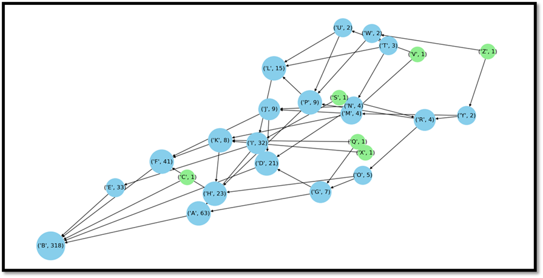

# tangle-demo-implemetation

## ABSTRACT
As effective as blockchain may be its constraints such as scalability and miners are what lead to the innovation of IOTA, a unique new platform for distributed ledgers that implement the architecture known as Tangle. With the world flourishing with efficient IOT devices that generate prodigious amounts of data, the concern for security, storage and privacy is more relevant than ever. With IOTA’s Tangle, which at its core uses a directed acyclic graph for storage and transaction purposes removes the use of miners that demands a significant aggregate of processing power and makes the platform lightweight in nature. In this project, we study and implement IOTA’s data structure, the Tangle, areas where it has been used and most significantly the edge it has over blockchain. 

<strong>Flow Diagram</strong>

The weighted Random walk provides us with a very efficient way of tip selection. Not following the proposed MCMC algorithm for mini computational gains does no good to the nodes and such lazy behaviour is discouraged by the other honest nodes. The added benefits of random walk in providing automatic solution to double spends and by providing a way to measure confidence of transaction approval makes it ideal for the scenario that IOTA aims to deal with

